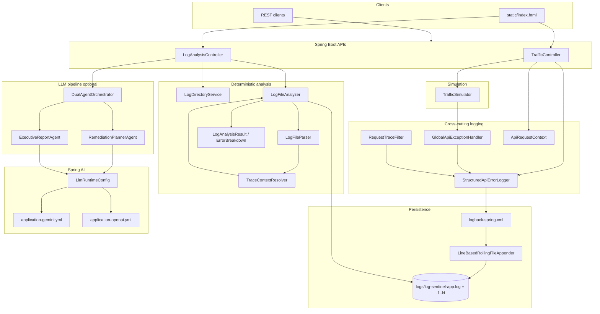

# Log Sentinel — architecture

POC for **file-based API log triage**: simulate failing traffic without business `log.error` calls, persist structured errors to a **line-count-rotated** log file, analyze with deterministic Java rules, then optional **two LLM agents** (remediation runbook + executive report).

## System diagram

## Layer responsibilities

| Layer | Responsibility |
|-------|----------------|
| **Traffic APIs** | Trigger failures; bind `customerId`, `orderId`, `amountInr`; batch loops log multiple failures per request |
| **Logging** | `/api/v1/` only → structured `API_FAILURE`; omit unknown ids from the line |
| **Log file** | Append-only; roll on physical line count (`LOG_MAX_LINES_PER_FILE`) |
| **Analysis** | Multi-file read, explicit customer counts, trace propagation, rule flags with `windows[]` |
| **Agents** | Both consume `LogAnalysisResult.toAgentPrompt()`; executive agent does **not** receive remediation markdown |
| **Config** | Thresholds, log path, rotation, `LLM_MAX_TOKENS`, LLM provider |

## Project layout — what each file does

### Root

| File | Purpose |
|------|---------|
| `README.md` | Quick start, APIs, env vars |
| `APPLICATION_GUIDE.md` | Operations, semantics, troubleshooting |
| `DEMO_SCRIPT.md` | Presenter steps |
| `pom.xml` | Maven: Spring Boot 3.5, Java 21, Spring AI |
| `Dockerfile` | Multi-stage: `mvn test` + JRE 21 image |
| `docker-compose.yml` | Port 8080, `.env`, `logs/` volume, env defaults |
| `.env.example` | `LOG_*`, `LLM_*`, provider keys |

### Documentation tree

See [docs/README.md](../README.md). Java package map: [PACKAGE_STRUCTURE.md](PACKAGE_STRUCTURE.md).

### Source code (summary)

| Package | Contents |
|---------|----------|
| `com.kgk.logsentinel` | `LogSentinelApplication` |
| `...config` | `LlmRuntimeConfig` |
| `...config.logging` | Line-based rolling appenders |
| `...domain.analysis` | `LogEvent`, `ErrorBreakdown`, `LogAnalysisResult` |
| `...service.analysis` | Parser, analyzer, directory listing, trace resolver |
| `...service.simulator` | `TrafficSimulator` |
| `...service.logging` | API failure logging, trace filter, global handler |
| `...service.agent` | Dual-agent LLM pipeline |
| `...web.controller` | REST endpoints |
| `...web.dto` | Request/response records |

### Resources

| Path | Purpose |
|------|---------|
| `application.yml` | App, rotation, analysis thresholds, `LLM_MAX_TOKENS` |
| `application-*.yml` | LLM provider profiles |
| `logback-spring.xml` | Console + `LineBasedRollingFileAppender` |
| `static/index.html` | Demo UI (traffic, log checkboxes, analyze) |

### Tests

`src/test/java` — `service.analysis`, `service.agent`, `config.logging` (rotation policy, analyzer multi-file / triple-error / trace resolver).

## Deterministic rules (Java)

- **Order flag:** `amountInr` > 150,000 on an `API_FAILURE` event.
- **Customer flag:** More than **3** distinct stack signatures within **3 seconds** among lines with explicit `customerId`. One `FlaggedCustomer` per id with `windows[]`.

## Related doc

[FLOW.md](FLOW.md) — request sequences · [PACKAGE_STRUCTURE.md](PACKAGE_STRUCTURE.md) — package layout
