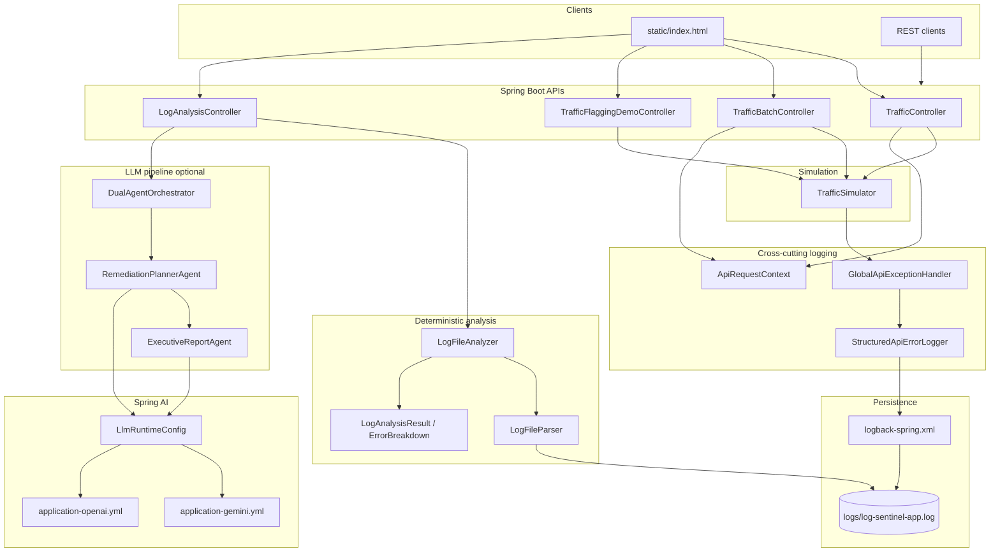

# Log Sentinel — architecture

POC for **file-based API log triage**: simulate failing traffic without business `log.error` calls, persist structured errors to a rolling log file, analyze with deterministic Java rules, then optional **two LLM agents** (remediation runbook + executive report).

## System diagram

## Layer responsibilities

| Layer | Responsibility |
|-------|----------------|
| **Traffic APIs** | Trigger failures; set `customerId`, `orderId`, `amountInr` on the request |
| **Logging** | Catch all API exceptions; write one structured `API_FAILURE` line per failure |
| **Log file** | Rolling append-only source of truth for analysis |
| **Analysis** | Parse file, group by customer/order, compute splits and rule flags |
| **Agents** | Remediation runbook (technical) → executive brief with solutions by issue type |
| **Config** | Thresholds, log path, LLM provider (Gemini / OpenAI) |

## Project layout — what each file does

### Root

| File | Purpose |
|------|---------|
| `README.md` | Quick start, APIs, env vars |
| `APPLICATION_GUIDE.md` | Operations, config, troubleshooting |
| `DEMO_SCRIPT.md` | Presenter steps for demos |
| `pom.xml` | Maven: Spring Boot 3.5, Java 21, Spring AI |
| `Dockerfile` | Multi-stage build (Maven test + JRE image) |
| `docker-compose.yml` | Port 8080, `.env`, `logs/` volume |
| `.env.example` | Template for API keys and provider |
| `.dockerignore` / `.gitignore` | Build and secret exclusions |

### Documentation tree

See [docs/README.md](../README.md). This file is under `docs/architecture/`. Full Java package map: [PACKAGE_STRUCTURE.md](PACKAGE_STRUCTURE.md).

### Source code (summary)

| Package | Contents |
|---------|----------|
| `com.kgk.logsentinel` | `LogSentinelApplication` |
| `...config` | LLM runtime configuration |
| `...domain.analysis` | `LogEvent`, `ErrorBreakdown`, `LogAnalysisResult` |
| `...service.analysis` | `LogFileParser`, `LogFileAnalyzer` |
| `...service.traffic` | `TrafficSimulator` |
| `...service.logging` | API failure logging + global handler |
| `...service.agent` | Dual-agent LLM pipeline |
| `...web.controller` | REST endpoints |
| `...web.dto` | Request/response records |

### Resources

| Path | Purpose |
|------|---------|
| `src/main/resources/application*.yml` | App + LLM profiles |
| `src/main/resources/logback-spring.xml` | File + console logging |
| `src/main/resources/static/index.html` | Demo UI |

### Tests

Mirror `service.analysis` and `service.agent` under `src/test/java/com/kgk/logsentinel/service/`.

## Deterministic rules (Java)

- **Order flag:** `amountInr` > 150,000 on an `API_FAILURE` event.
- **Customer flag:** More than **3** distinct stack signatures within **3 seconds** (not raw error count).

## Related doc

See [FLOW.md](FLOW.md) for request-level sequence diagrams and [PACKAGE_STRUCTURE.md](PACKAGE_STRUCTURE.md) for package layout.
