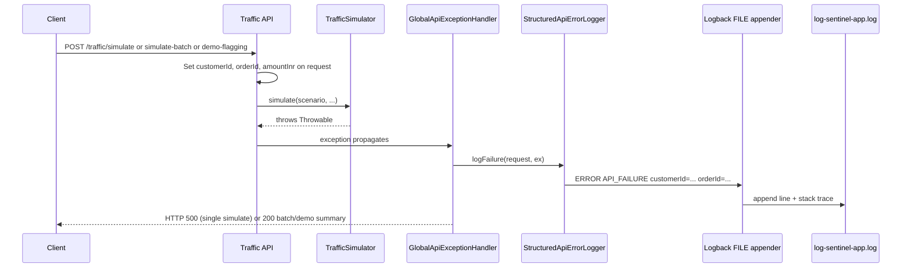
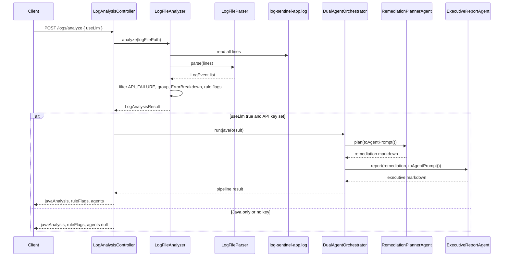
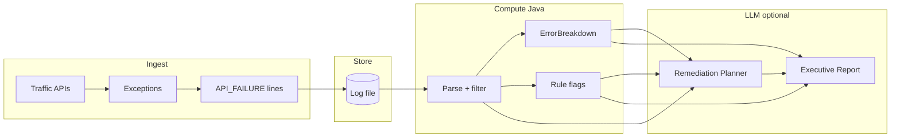
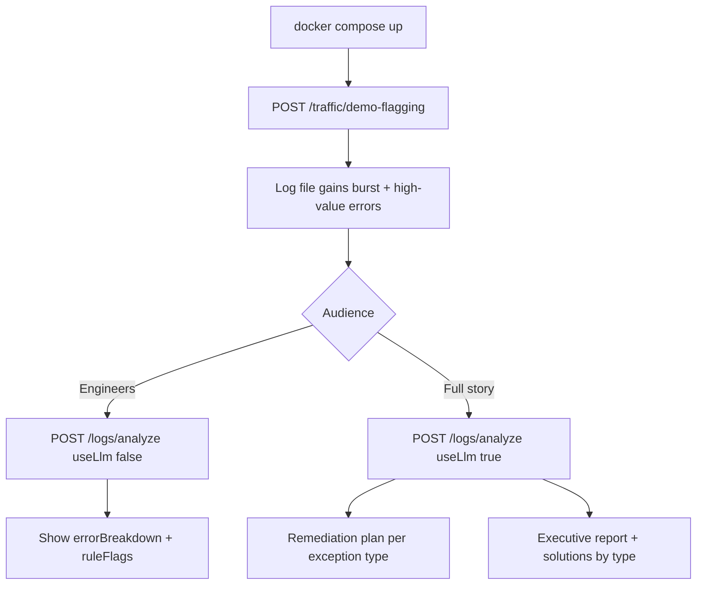

# Log Sentinel — flow diagrams

End-to-end paths through the POC. Pair with [ARCHITECTURE.md](ARCHITECTURE.md) and [PACKAGE_STRUCTURE.md](PACKAGE_STRUCTURE.md).

## 1. Traffic → log file (API 1)

Failures are recorded by the global handler, not by simulator code.

**Batch / demo:** controller may catch exceptions and call `logFailure` directly so multiple failures are logged in one HTTP call.

## 2. Analyze log file (API 2)

## 3. Data flow (logical)

## 4. Demo happy path (presenter)

## 5. What each stage produces

| Stage | Output |
|-------|--------|
| Traffic | Lines in `logs/log-sentinel-app.log` with `customerId`, `orderId`, `amountInr`, `exception=` |
| Java analyze | `javaAnalysis.errorBreakdown`, `byCustomer`, `byOrder`, `ruleFlags` |
| Remediation Planner | `agents.remediationPlanMarkdown` — technical runbook |
| Executive Report | `agents.executiveReportMarkdown` — severity, impact, solutions by issue type |

## API quick reference

| Method | Path | Effect |
|--------|------|--------|
| POST | `/api/v1/traffic/simulate` | One failure → log (+ usually 500) |
| POST | `/api/v1/traffic/simulate-batch` | Many failures, one customer → log |
| POST | `/api/v1/traffic/demo-flagging` | Canned burst + VIP order → log |
| POST | `/api/v1/logs/analyze` | Read file, analyze, optional LLM |
