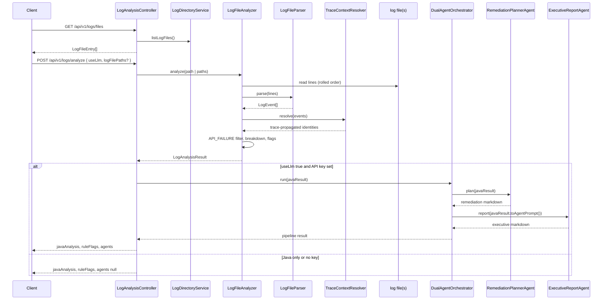
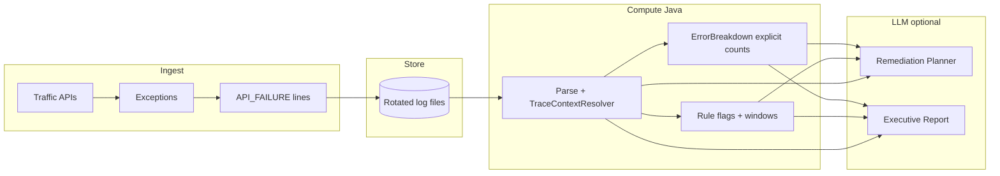
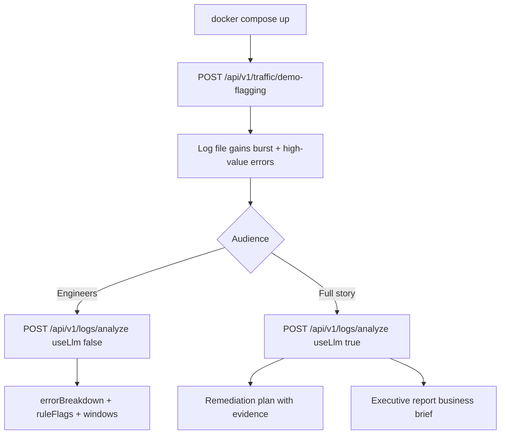

# Log Sentinel — flow diagrams

End-to-end paths through the POC. Pair with [ARCHITECTURE.md](ARCHITECTURE.md) and [PACKAGE_STRUCTURE.md](PACKAGE_STRUCTURE.md).

## 1. Traffic → log file

Failures are recorded by the global handler or by controllers that catch and call `StructuredApiErrorLogger` directly.

```mermaid
sequenceDiagram
    participant C as Client
    participant API as TrafficController
    participant TS as TrafficSimulator
    participant GEH as GlobalApiExceptionHandler
    participant SAL as StructuredApiErrorLogger
    participant LB as LineBasedRollingFileAppender
    participant F as log file

    C->>API: POST /api/v1/traffic/simulate-batch | demo-flagging | simulate-single-trace-triple-error
    API->>API: bind customerId, orderId, amountInr (batch)
    loop each scenario
        API->>TS: simulate(...)
        TS-->>API: throws
        API->>SAL: logFailure (or logFailureWithMdc)
    end
    Note over API,SAL: Uncaught errors on /api/v1/ also go GEH → SAL
    SAL->>LB: ERROR API_FAILURE (optional customerId/orderId)
    LB->>F: append line + stack; roll at max lines
    API-->>C: 200 summary JSON
```

**demo-flagging:** one shared `traceId`/`spanId` across burst + VIP via `logFailureWithMdc`.

## 2. List and analyze log files



## 3. Data flow (logical)



Agent 2 does **not** consume Agent 1 output; both read the Java analysis payload.

## 4. Demo happy path (presenter)



## 5. What each stage produces

| Stage | Output |
|-------|--------|
| Traffic | `API_FAILURE` lines; `traceId` in MDC; rotation at line limit |
| Java analyze | `javaAnalysis.errorBreakdown`, `byCustomer` / `byOrder`, `ruleFlags.flaggedCustomers[].windows` |
| Remediation Planner | `agents.remediationPlanMarkdown` |
| Executive Report | `agents.executiveReportMarkdown` |

## API quick reference

| Method | Path | Effect |
|--------|------|--------|
| POST | `/api/v1/traffic/simulate-batch` | Many failures in one request → log |
| POST | `/api/v1/traffic/demo-flagging` | Canned burst + VIP → log |
| POST | `/api/v1/traffic/simulate-single-trace-triple-error` | Three failures, one trace, counting demo |
| GET | `/api/v1/logs/files` | List active + rolled files |
| POST | `/api/v1/logs/analyze` | Read file(s), analyze, optional LLM |
