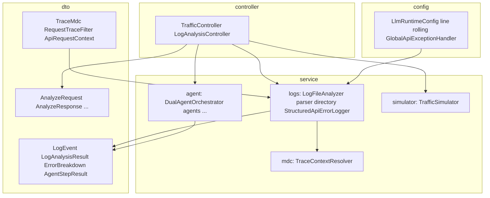

# Package structure

Flat layout under `com.kgk.logsentinel` for **`config`**, **`controller`**, and **`dto`**. Business logic lives under **`service`** in four subpackages.

```text
com.kgk.logsentinel
├── LogSentinelApplication.java     # Bootstrap (@SpringBootApplication — scans subpackages)
├── config/                         # @Configuration, Logback appenders, @RestControllerAdvice
├── controller/                     # REST controllers
├── dto/                            # HTTP records, trace/MDC, analysis model types, servlet filter
└── service/
    ├── agent/                      # LLM agents, orchestrator, markdown, rate-limit retry
    ├── logs/                       # Log parse/analyze/directory, structured API error logging
    ├── simulator/                  # Traffic failure simulation
    └── mdc/                        # Trace context propagation for analysis
```



## `config`

| Class | Role |
|-------|------|
| `LlmRuntimeConfig` | LLM provider / API key presence |
| `LineBasedRollingFileAppender` | Rolling file appender; seeds line count on startup |
| `LineCountTriggeringPolicy` | Roll after `maxLinesPerFile` physical newlines |
| `GlobalApiExceptionHandler` | Catch-all; log only `/api/v1/` paths |

Referenced from `logback-spring.xml` as `com.kgk.logsentinel.config.*` (appenders/policies only).

## `controller`

| Class | Role |
|-------|------|
| `TrafficController` | `simulate-batch`, `demo-flagging`, `simulate-single-trace-triple-error` |
| `LogAnalysisController` | `GET /files`, `POST /analyze` |

## `dto`

| Class | Role |
|-------|------|
| `TrafficRequest` | Batch traffic body (`scenarios`, ids, amount) |
| `AnalyzeRequest` | `useLlm`, `logFilePath`, `logFilePaths` |
| `LogFileEntry` | File listing entry |
| `AnalyzeResponse` | Java result + `ruleFlags` + `agents` |
| `RuleFlagSummary` | Flagged ids + detail lists |
| `AgentReports` | Remediation + executive markdown |
| `LogEvent` | Parsed error + stack signature; `explicitCustomerId` |
| `ErrorBreakdown` | Totals and splits (customer splits = explicit lines only) |
| `LogAnalysisResult` | Full Java analysis + `toAgentPrompt()`; `FlaggedCustomer.windows[]` |
| `AgentStepResult` | Per-agent output metadata |
| `RequestTraceFilter` | `@Component` filter — MDC `traceId` / `spanId` per HTTP request |
| `TraceMdc` | MDC key names and request attribute keys |
| `ApiRequestContext` | Request attribute keys for traffic bodies |

## `service.agent`

| Class | Role |
|-------|------|
| `DualAgentOrchestrator` | Remediation then executive; shared Java input only |
| `RemediationPlannerAgent` | Dev-lead runbook + evidence |
| `ExecutiveReportAgent` | Product-owner brief (no technical evidence) |
| `AgentMarkdownFormatter` | Markdown newline normalization |
| `GeminiRateLimitRetry` | 429 / quota helper |

## `service.logs`

| Class | Role |
|-------|------|
| `LogFileParser` | Lines → `LogEvent` |
| `LogFileAnalyzer` | Rules, grouping, `ErrorBreakdown`, flags |
| `LogDirectoryService` | Active path, list rolled files, roll index ordering |
| `StructuredApiErrorLogger` | `API_FAILURE` structured lines; id hygiene |

## `service.simulator`

| Class | Role |
|-------|------|
| `TrafficSimulator` | Scenario-based failures (no business logging) |

## `service.mdc`

| Class | Role |
|-------|------|
| `TraceContextResolver` | Propagate customer/order by `traceId` |

## Tests

```text
src/test/java/com/kgk/logsentinel/
├── config/          # LineCountTriggeringPolicy
└── service/
    ├── agent/       # AgentMarkdownFormatter, GeminiRateLimitRetry
    ├── logs/        # Analyzer, directory, StructuredApiErrorLogger
    └── mdc/         # TraceContextResolver
```

## Resources & docs (repo layout)

```text
src/main/resources/
├── application.yml
├── application-gemini.yml
├── application-openai.yml
├── logback-spring.xml
└── static/index.html

docs/
├── README.md
├── architecture/     # ARCHITECTURE.md, FLOW.md, PACKAGE_STRUCTURE.md
└── operations/       # gemini-free-tier.md
```

Root-level `README.md`, `APPLICATION_GUIDE.md`, `DEMO_SCRIPT.md` remain entry points.
