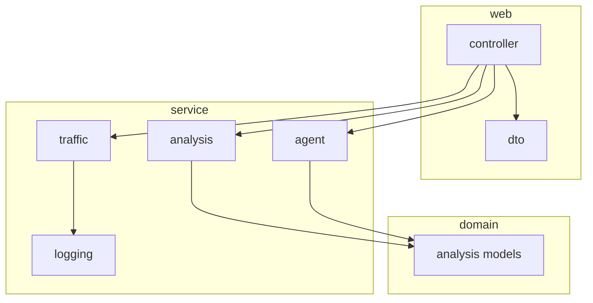

# Package structure

Layered layout for Log Sentinel (Spring Boot). Dependency direction: **web → service → domain**; `config` is cross-cutting.

```text
com.kgk.logsentinel
├── LogSentinelApplication.java     # Bootstrap
├── config/                         # Framework & app configuration
├── domain/                         # Pure models (no Spring web dependencies)
│   └── analysis/
├── service/                        # Business logic & integrations
│   ├── analysis/
│   ├── traffic/
│   ├── logging/
│   └── agent/
└── web/                            # HTTP API surface
    ├── controller/
    └── dto/
```



## `config`

| Class | Role |
|-------|------|
| `LlmRuntimeConfig` | LLM provider / API key presence |

## `domain.analysis`

Immutable records — parser output and analyzer results. Safe to serialize in API responses.

| Class | Role |
|-------|------|
| `LogEvent` | One parsed log error + stack signature |
| `ErrorBreakdown` | Totals and splits by exception type, customer, order |
| `LogAnalysisResult` | Full Java analysis + `toAgentPrompt()` |

## `service.analysis`

| Class | Role |
|-------|------|
| `LogFileParser` | Read log file lines → `LogEvent` |
| `LogFileAnalyzer` | Rules, grouping, `ErrorBreakdown`, flags |

## `service.traffic`

| Class | Role |
|-------|------|
| `TrafficSimulator` | Scenario-based failures (no business logging) |

## `service.logging`

| Class | Role |
|-------|------|
| `ApiRequestContext` | Request attribute keys |
| `StructuredApiErrorLogger` | `API_FAILURE` structured lines |
| `GlobalApiExceptionHandler` | Catch-all API exception → log file |

## `service.agent`

| Class | Role |
|-------|------|
| `DualAgentOrchestrator` | Agent 1 → Agent 2 pipeline |
| `RemediationPlannerAgent` | Technical runbook |
| `ExecutiveReportAgent` | Executive brief + solutions by type |
| `AgentStepResult` | Per-agent output metadata |
| `AgentMarkdownFormatter` | Markdown newline normalization |
| `GeminiRateLimitRetry` | 429 / quota helper |

## `web.controller`

| Class | Role |
|-------|------|
| `TrafficController` | `POST .../simulate` |
| `TrafficBatchController` | `POST .../simulate-batch` |
| `TrafficFlaggingDemoController` | `POST .../demo-flagging` |
| `LogAnalysisController` | `POST .../logs/analyze` |

## `web.dto`

| Class | Role |
|-------|------|
| `SimulateTrafficRequest` | Single traffic body |
| `TrafficRequest` | Batch traffic body |
| `AnalyzeRequest` | Analyze body (`useLlm`, optional path) |
| `AnalyzeResponse` | Java result + `ruleFlags` + `agents` |
| `RuleFlagSummary` | Flagged ids + detail lists |
| `AgentReports` | Remediation + executive markdown |

## Tests (mirror `service`)

```text
src/test/java/com/kgk/logsentinel/
└── service/
    ├── analysis/    # LogFileAnalyzer*, parser integration
    └── agent/       # AgentMarkdownFormatter, GeminiRateLimitRetry
```

## Resources & docs (repo layout)

```text
src/main/resources/
├── application.yml
├── application-gemini.yml
├── application-openai.yml
├── logback-spring.xml
└── static/index.html

docs/
├── README.md
├── architecture/     # ARCHITECTURE.md, FLOW.md, PACKAGE_STRUCTURE.md
└── operations/       # gemini-free-tier.md
```

Root-level `README.md`, `APPLICATION_GUIDE.md`, `DEMO_SCRIPT.md` remain entry points for humans.
