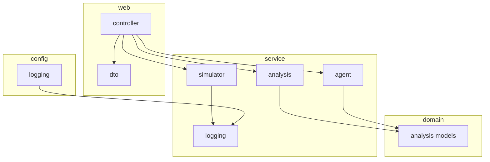

# Package structure

Layered layout for Log Sentinel (Spring Boot). Dependency direction: **web → service → domain**; `config` is cross-cutting.

```text
com.kgk.logsentinel
├── LogSentinelApplication.java     # Bootstrap
├── config/                         # Framework & app configuration
│   └── logging/                    # Line-based log rotation
├── domain/                         # Pure models (no Spring web dependencies)
│   └── analysis/
├── service/                        # Business logic & integrations
│   ├── analysis/
│   ├── simulator/
│   ├── logging/
│   └── agent/
└── web/                            # HTTP API surface
    ├── controller/
    └── dto/
```



## `config`

| Class | Role |
|-------|------|
| `LlmRuntimeConfig` | LLM provider / API key presence |

## `config.logging`

| Class | Role |
|-------|------|
| `LineBasedRollingFileAppender` | Rolling file appender; seeds line count on startup |
| `LineCountTriggeringPolicy` | Roll after `maxLinesPerFile` physical newlines |

## `domain.analysis`

Immutable records — parser output and analyzer results.

| Class | Role |
|-------|------|
| `LogEvent` | Parsed error + stack signature; `explicitCustomerId` |
| `ErrorBreakdown` | Totals and splits (customer splits = explicit lines only) |
| `LogAnalysisResult` | Full Java analysis + `toAgentPrompt()`; `FlaggedCustomer.windows[]` |

## `service.analysis`

| Class | Role |
|-------|------|
| `LogFileParser` | Lines → `LogEvent` |
| `TraceContextResolver` | Propagate customer/order by `traceId` |
| `LogFileAnalyzer` | Rules, grouping, `ErrorBreakdown`, flags |
| `LogDirectoryService` | Active path, list rolled files, roll index ordering |

## `service.simulator`

| Class | Role |
|-------|------|
| `TrafficSimulator` | Scenario-based failures (no business logging) |

## `service.logging`

| Class | Role |
|-------|------|
| `RequestTraceFilter` | MDC `traceId` / `spanId` per HTTP request |
| `TraceMdc` | MDC key names |
| `ApiRequestContext` | Request attribute keys for traffic bodies |
| `StructuredApiErrorLogger` | `API_FAILURE` structured lines; id hygiene |
| `GlobalApiExceptionHandler` | Catch-all; log only `/api/v1/` paths |

## `service.agent`

| Class | Role |
|-------|------|
| `DualAgentOrchestrator` | Remediation then executive; shared Java input only |
| `RemediationPlannerAgent` | Dev-lead runbook + evidence |
| `ExecutiveReportAgent` | Product-owner brief (no technical evidence) |
| `AgentStepResult` | Per-agent output metadata |
| `AgentMarkdownFormatter` | Markdown newline normalization |
| `GeminiRateLimitRetry` | 429 / quota helper |

## `web.controller`

| Class | Role |
|-------|------|
| `TrafficController` | `simulate-batch`, `demo-flagging`, `simulate-single-trace-triple-error` |
| `LogAnalysisController` | `GET /files`, `POST /analyze` |

## `web.dto`

| Class | Role |
|-------|------|
| `TrafficRequest` | Batch traffic body (`scenarios`, ids, amount) |
| `AnalyzeRequest` | `useLlm`, `logFilePath`, `logFilePaths` |
| `LogFileEntry` | File listing entry |
| `AnalyzeResponse` | Java result + `ruleFlags` + `agents` |
| `RuleFlagSummary` | Flagged ids + detail lists |
| `AgentReports` | Remediation + executive markdown |

## Tests

```text
src/test/java/com/kgk/logsentinel/
├── config/logging/          # LineCountTriggeringPolicy
└── service/
    ├── analysis/            # Analyzer, trace resolver, multi-file, triple-error
    └── agent/               # AgentMarkdownFormatter, GeminiRateLimitRetry
```

## Resources & docs (repo layout)

```text
src/main/resources/
├── application.yml
├── application-gemini.yml
├── application-openai.yml
├── logback-spring.xml
└── static/index.html

docs/
├── README.md
├── architecture/     # ARCHITECTURE.md, FLOW.md, PACKAGE_STRUCTURE.md
└── operations/       # gemini-free-tier.md
```

Root-level `README.md`, `APPLICATION_GUIDE.md`, `DEMO_SCRIPT.md` remain entry points.
